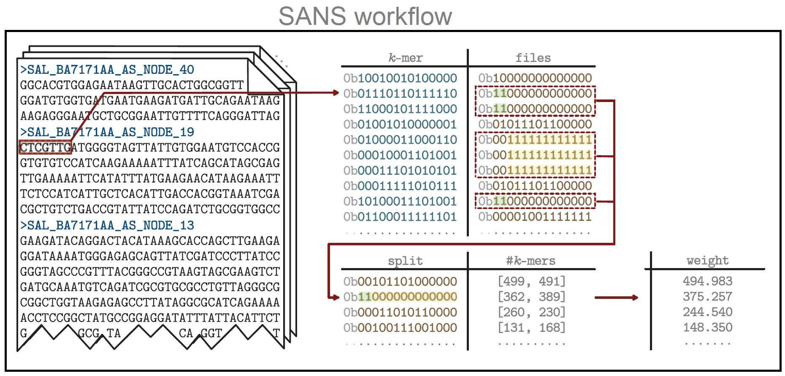
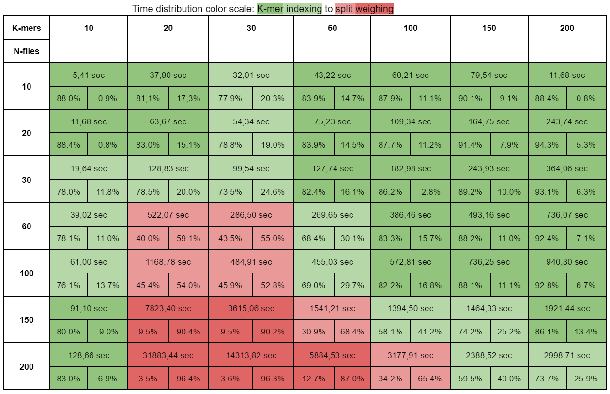
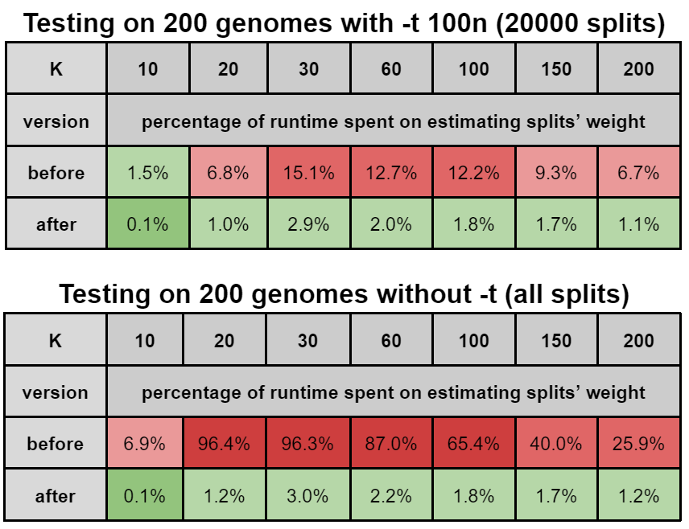
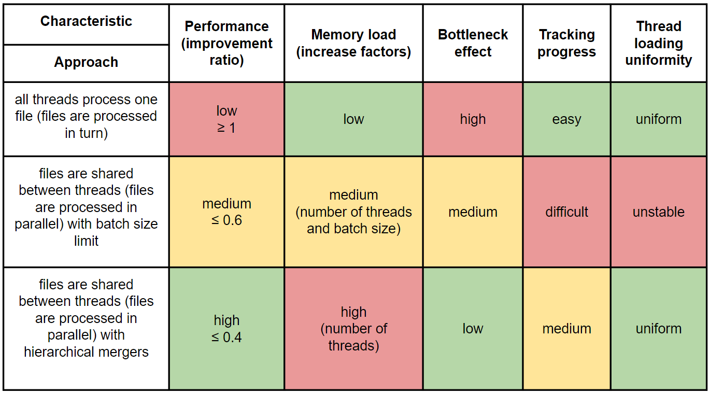

## SANS serif optimization
### 2023 Spring project, Bioinformatics Institute

Students: 
- Zaur Kambiev, Bioinformatics Institute
- Rustam Basyrov, Bioinformatics Institute

Supervisor:
- Kirill Antonets, All-Russia Research Institute for Agricultural Microbiology

### Introduction
[SANS serif](https://gitlab.ub.uni-bielefeld.de/gi/sans) is a tool for whole-genome-based phylogeny estimation based on k-mers in assembled genomes / reads, or coding sequences / amino acid sequences. It doesn’t use multiply alignment to tree reconstruction, but still takes a lot of time to work. In the our research, we aimed to find out bottlenecks in tool execution and tried to optimize them.

### Analysis
Profiling by [Gperftools CPU Profiler](https://github.com/gperftools/gperftools) (version 2.10) showed the following distribution of running time between the main stages of the algorithm (reading k-mers and weighting splits).

Analyzing the code, we found two problems:
- Reading input files is done in one thread.
- The final sorted list of splits is created simultaneously with filling the hash table of splits. This is time consuming, which is especially noticeable if the length of the resulting list is not limited by the corresponding input argument (-t).

It is on these issues that we have focused our attention.

### Results

1. We moved the formation of the final list of splits into a separate procedure, which goes after filling the hash table of splits. This stabilized the running time of splits’ weighting, and it began to take less than 4% of the total program running time.

The modified version of SANS serif is available in the main branch.

2. Three different approaches to file processing parallelization using [OpenMP](https://www.openmp.org) were proposed, implemented and compared on dataset of 200 *Bacillus* genomes.

The second and third approaches, as the most applicable, are available in branches parallel_batch (the second approach) and parallel_mergers (the third approach).

### References

1. Andreas Rempel , Roland Wittler, SANS serif: alignment-free, whole-genome-based phylogenetic reconstruction, Bioinformatics, Volume 37, Issue 24, December 2021, Pages 4868–4870, https://doi.org/10.1093/bioinformatics/btab444
2. Google Performance Tools, https://gperftools.github.io/gperftools/cpuprofile.html
3. Chandra, R., Dagum, L., Kohr, D., Menon, R., Maydan, D., & McDonald, J. (2001). Parallel programming in OpenMP. Morgan kaufmann.
